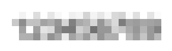
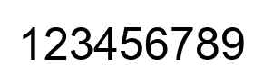
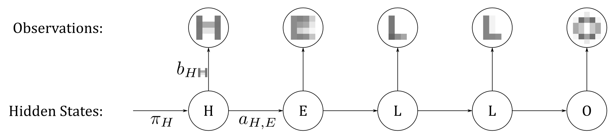
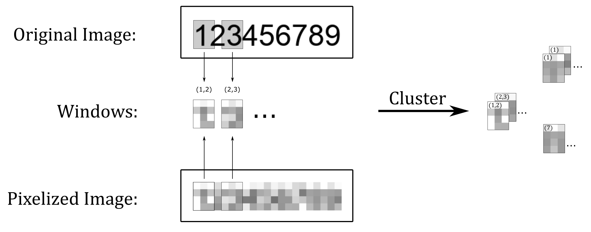
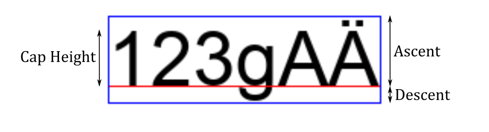
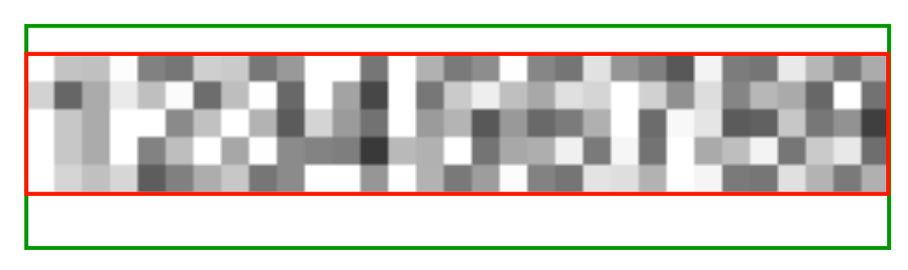
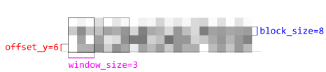

# Depix-HMM
Depix-HMM is a tool for recovering text from pixelized screenshots. As can be inferred from the project name, it was 
inspired by the [Depix](https://github.com/beurtschipper/Depix) library and uses an HMM-based approach, which is supposed to
result in a higher accuracy and flexibility.

It is an open source implementation of the paper [On the (In)effectiveness of Mosaicing and Blurring as Tools for Document Redaction](https://www.researchgate.net/publication/305423573_On_the_Ineffectiveness_of_Mosaicing_and_Blurring_as_Tools_for_Document_Redaction) by Hill, Zhou, Saul and Shacham. 
I recommend checking out the paper, it is a very insightful read and provides the necessary background I neither have
the time nor space to explain in this readme. 

## Example
Below is an example with a font size of 50 and a pixelization block size of 12:

| Pixelized | Recovered |
|-----------|-----------|
|  | 


## Theory

### Hidden Markov Models
Hidden Markov Models (HMMs) are a way to model a large array of problems as graphs. In contrast to the simpler *Markov Chain*, 
the so called *states* aren't accessible in a Hidden Markov Model. Instead, we can only access an *observation* that is 
derived from the underlying state. 

In the (simplified) illustration below, the observations are the color values of the pixelized grid. The hidden states are 
the respective underlying original character:



In addition to  (the set of hidden states of the model) and  (the set of observable symbols), the following three 
probabilities are required to fully describe the model:
- : The probability of starting in state . Two examples: When recovering passwords without any additional information, these probabilities are identical for each state. For recovering English language text, the probability of a word starting with `s`, `c`, `p`, `d` are higher than the probability of a word starting with `x`, `q` or `z`. See this [link](https://www.wolfram.com/language/11/text-and-language-processing/frequencies-of-letters-vs-first-letters.html?product=language) for more information. 
- : The probability of going from state *i* to state *j*. Again, if we don't have additional information about the text to be recovered (as is the case with passwords), all of these probabilities will be equal. However, in the English language, the letter `q` is followed by the letter `u` with a very high probability. 
- : The probability of an observation  being generated from a state *i*. Finding meaningful probabilities for this matrix is the hardest part of the whole endeavor and is explained in the next section.

Note: 
- For the sake of brevity, a few simplifications have been made in this explanation. For example, it is very unlikely that the hidden state only contains one letter (e.g. `H`). 
We always look at *windows* of the pixelized image, and these usually contain more than one character, e.g. `(H,E)`. 
- In order to keep the space of possible observations small enough, clustering is performed. So, not the pixel values of e.g.  is the observed symbol, but the corresponding index of the cluster. 


### Generating Training Data
To estimate values for the three probability matrices defining the Hidden Markov Model, training data is generated. 

First, a list of texts is generated that mimics the text to be pixelized. 
This could be passwords containing digits, upper- and lowercase letters with a length between 6 and 9, matching the regex `[a-zA-Z\d]{6,9}`.
Or it could be a dump of real-life email addresses or words from English wikipedia articles. 

Next, the texts are rendered using the same font and fontsize of the pixelized image with the unknown text. These images are then
pixelized. Since we generated these images ourselves, we can then cut the pixelized images into windows with *known* hidden state
(the characters at the position of the windows). 
From there, it is trivial to calculate starting probabilities  and 
transition probabilities . 

As mentioned before, generating the emission probabilities requires an extra step. To reduce the number of possible observable
states, the windows are clustered according to their pixel values. Taking the example from the illustration below, 
we can see that a window that falls into the left-most cluster has a 50% probability of encoding the tuple `(1,2)` and `(2,3)`, respectively.
A window falling into the top-right cluster always encodes the tuple `(1)`.

### Recovering Hidden Text
The pixelized image with the unkown text is then fed into the trained Hidden Markov Model.
It will be cut into windows the same way the training data was. Each window is then assigned to the nearest cluster and the Viterbi Algorithm is 
used to recover the most likely sequence of hidden states. 

This could result in the tuples `(1), (1,2), (1,2), (2), (2,3), (3,4), ...` from which the original text can be reconstructed to be `1234...`



## Installation and Usage
Download the repository.

Set up and activate your virtual environment. On windows, for example, type into your console:
```
python -m venv venv
.\venv\Scripts.activate.bat
```

Install the packages from the `requirements.txt` file:
```
pip install -r requirements.txt
```

Use the code samples from the `examples` and `experiments` folder to get started. If you want to use the code to recover 
text from your own images, read the sections below. Providing an easy-to-use tool with a good user experience honestly 
wasn't the goal of this project. Reach out to me though, I'm more than happy to help you out.

### Correct Cropping of Images

##### Font Metrics
To start out with, font metrics can be quite complex. As a quick overview, see the image below. 
The red line is the so-called *baseline*, on which the letters 'sit' on top. While the *ascent* measures the maximum height 
a letter of this font can have, most letters will only reach the smaller *cap height*.




##### How to Crop Your Image
My implementation of the algorithm is a bit *dumb*. For example, when we care about images containing only 
digits, it is obvious that black pixels can only be found between the baseline and the cap height, and not above or below.
However, the algorithm creates its training data over the full height (ascent + descent) that the font could possibly have, and 
so you have to crop accordingly! 

See the image below: Intuitively, one would have cropped at the red border, however the green border is correct! With
the font size and y-offset of the pixelization, there is one "invisible" grid-row on top, and two on the bottom. 

It is relatively easy to crop the images in the training pipeline, I just haven't come around to doing it.



### Explanation of Parameters
Configuring the code is done by setting two sets of parameters. The first set are the `PictureParameters`. They contain the following values:
- `pattern`: A regex pattern to generate sample text from. For passwords with a length between 6 and 9 characters containing digits, 
lower- and uppercase letters, this would be `r'[a-zA-Z\d]{6-9}'`. See the `rstr` package on [github](https://github.com/leapfrogonline/rstr) 
for more information. One possible improvement would be to feed a corpus of natural language data into the training pipeline.
- `font`: The font that is most likely used. Often, we want to decode information taken from a partially pixelized screenshot.
In this case, it is possible to infer the used font from the unobscured text that is still visible. Note that the availability
of fonts varies by operating system. Arial and the MICR Encoding Font are included in the `/resources/fonts` folder. 
- `block_size`: The size of on pixelized block in px. See visualization below. 
- `randomize_pixelization_origin_x`: If set to `false`, the pixelization always starts at the leftmost pixel of the rendered font. 
However, this is not very realistic, as the person performing the pixelization most likely did not pay attention where they set their origin.
It is recommended to always leave this at `true`. This is especially important for monospaced fonts, where the constant character width
is a multiple of the window size. 
- `window_size`: The width (in blocks) of one window. There is a tradeoff - a wide window will contain more information, 
but it is also possible to contain multiple characters. Choose the value in a way, that nore 3-Tuples will be generated in the training
data, since this bloats the search space by one order of magnitude. Hints will given in the terminal output.
- `offset_y`: As explained in the previous section about Font Metrics, the font "rests" on the so-called baseline. This parameter
measures the offset between the baseline and the beginning of the next pixel grid in px. The original paper has shown that
the algorithm is somehow robust against small errors in estimating this parameter (see Figure 14 in the original paper). 
However, when testing I found this the trickiest thing to get right. Might require some experimentation.

The second set are the `TrainingParameters`:
- `n_img_train`: Number of images used to estimate the parameters of the HMM. Usually in the magnitude of 10.000
- `n_img_test`: Number of images used to evaluate the estimated parameters. Note that this will NOT show you whether you have 
estimated the parameters from the image you want to decode correctly (`pattern`, `font`, `block_size`, `offset_y`). 
It will only tell you how the model performs on the synthetic data.
- `n_clusters`: Number of clusters for k-means clustering. Should be high enough so that every tuple can possibly have its 'own'
cluster. As an example, if you train the HMM on images containing only digits, and your `window_size` is chosen in a way that only
1- and 2-Tuples are created (`(0), (1), (2), ... (0,0), (0,1), ... (9,9)`), this should be at least 110. Don't go too much higher, 
otherwise some clusters are empty, which will result in a cryptic error message. Fixing this is on the roadmap.



When using `PictureParametersGridSearch` and `TrainingParametersGridSearch`, some of these parameters can be turned into lists. 
Grid search will be performed. See the `parameters.py` file for further information. Also remember the information given 
above under the `n_img_test` bullet point when doing a grid search.

There is an additional `LoggingParameters`, which is self-explanatory. 


## Final Thoughts
I replicated the author's most simple experiment (p. 409ff) with US bank account numbers (see the appropriately 
named `experiment_bank_account_numbers.py` for more details) and can confirm their findings. 

As mentioned above, the repository at its current state provides a working, but very proof-of-concept-y implementation of the
original paper. Be ready for some frustration when you let it loose on your own images. I'm happy to help out if you have
an interesting use case!

For a more refined experience, I would recommend the highly popular [Depix](https://github.com/beurtschipper/Depix) tool.